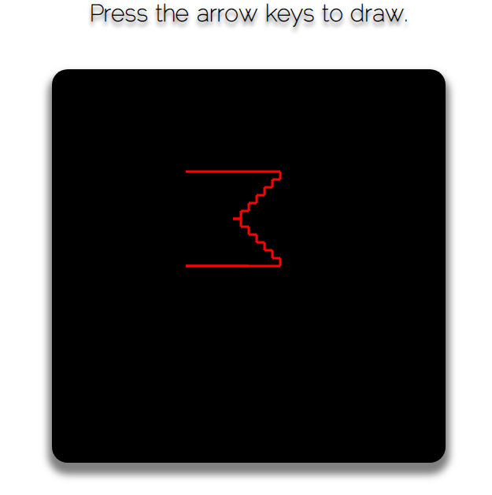

   

    
<h6 align = "center">SigmaΣCode</h6>

<h1 align="center">Keyboard Movement</h1>

 JavaScript application.

 

## Captures

    

## Features

- Use of CSS.
- Use of JavaScript.
- This is a little pen to draw with the arrow keys, the easy thing was draw, the hard thing was learn how the keyboard works and give it the capacity of detect many keys at the same time. why? for what? you guess it well ;) to control a character in a video game. Try push one side then press the opposite arrow, then release one of them, what happen?
also pres two or three to move in diagonal an release one to continue at the same direction that hasn't been release. If there is another way to do full controls in JavaScript I don't care, I am proud of made this without had any idea.

## See it online

- [`netlify`](https://keyboardmovement.netlify.com)
- [`codepen`](https://codepen.io/LeonAGA/pen/yvXEMJ)

## Links to other proyects

- [`Final Fantasy VII Menu`](https://github.com/LeonAGA/Final_Fantasy_VII_Menu)
- [`Event Seeker`](https://github.com/LeonAGA/Events_Seeker)
- [`Agenda`](https://github.com/LeonAGA/Agenda)    
- [`Message Box`](https://github.com/LeonAGA/Message_Box_LocalStorage)   
- [`Expenses Account`](https://github.com/LeonAGA/Expenses_Account)  
                             
